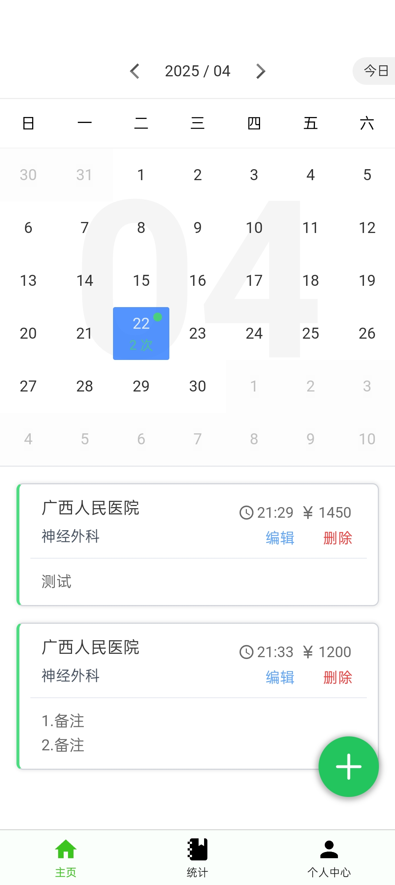
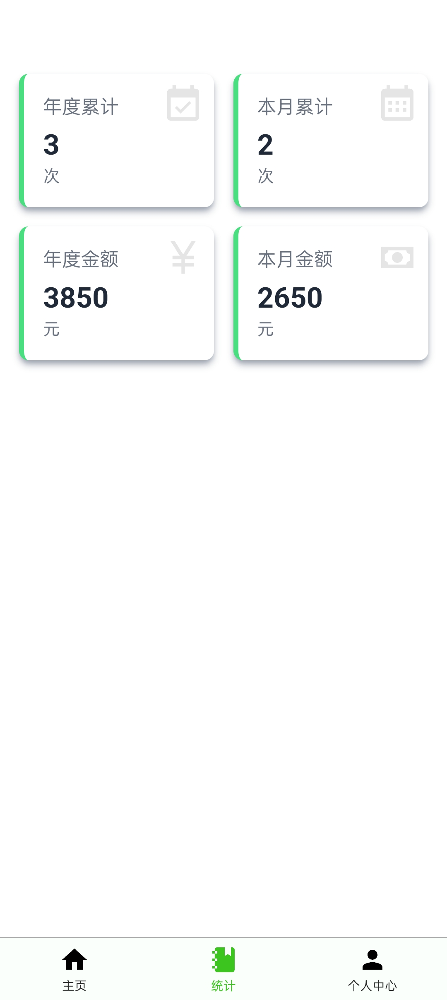

# 俞行日记

基于 [`weapp-tailwindcss`](https://github.com/sonofmagic/weapp-tailwindcss) 的 `vite` + `vue3` + `tailwindcss` 模板

俞行日记是一款可以记录医院访问记录，并统计数据的移动应用。  
俞行日记不会联网，全程离线单机使用。  

# 主要功能

1.可以记录医院名称，科室，消费金额，备注，到访时间  
2.统计展示每一年相关数据  
3.导出转移数据到其他设备

# 项目截图

